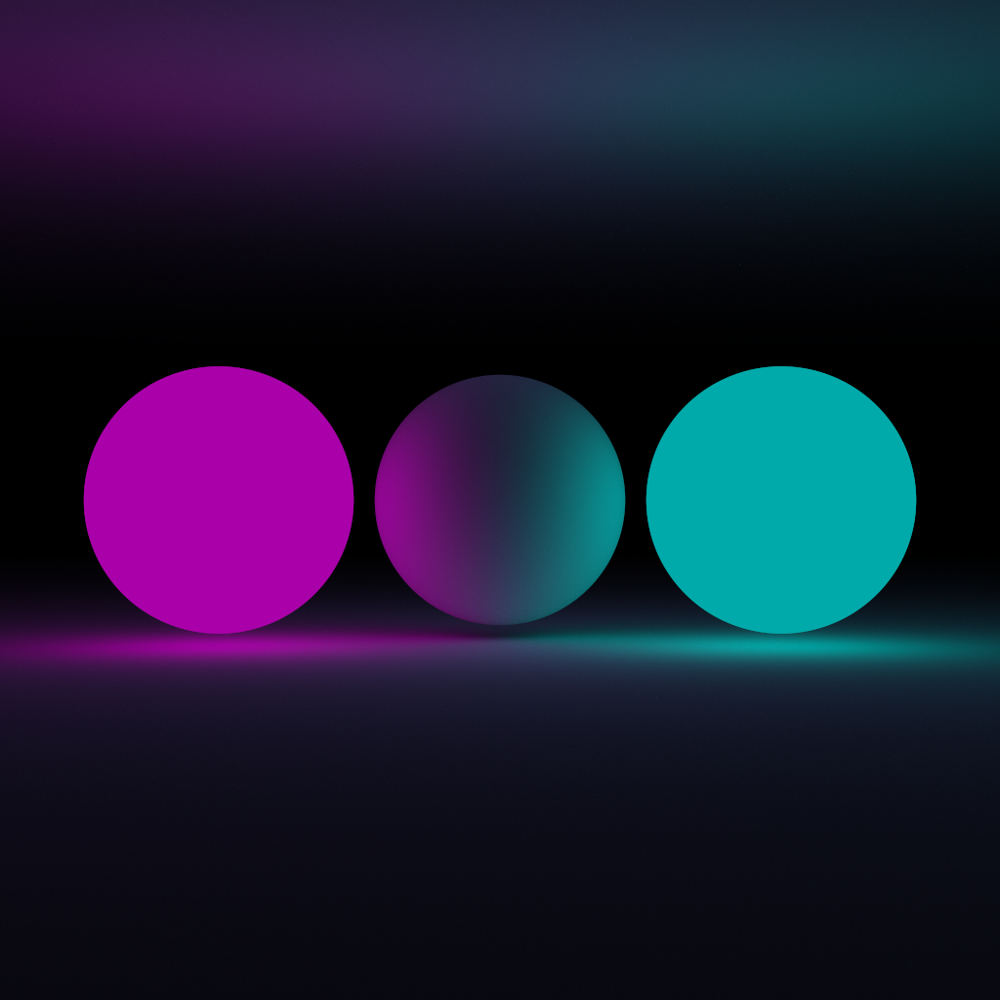

# Rust Graphics

This repository contains my experiments with graphics with rust. 

`src/math` contains the `math` package, which contains useful linear algebra primitives.

`src/marcher` contains the `marcher` package, which includes basic raymarched graphics functions.

`src/path_tracer` contains the `marcher` package, which includes functions for ray tracing.

